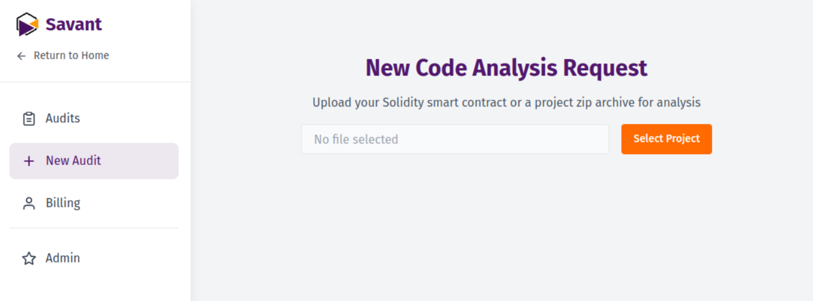

When you want to load a project from GitHub to [Savant Chat](https://savant.chat), you can download the repository as a ZIP archive and upload it to Savant Chat.



In most cases, it's enough, and it will work OK.

But sometimes repositories use non-standard dependency manager configurations, outdated language versions, and especially
non-open-source libraries. Additionally, during archiving, the structure of subrepositories may not be completely transferred, which is critical for foundry to work.

In this case, to upload your files to Savant Chat, you'll need to take a few additional steps.

First, download your project locally and install all its dependencies: both nodejs and foundry (if it's being used).

Then save the following script savant-build.sh in the root folder of your project:

```bash
#!/bin/bash

if command -v realpath >/dev/null 2>&1; then
    DIR_NAME=$(basename "$(dirname "$(realpath "$0")")")
else
    DIR_NAME=$(basename "$(dirname "$(cd "$(dirname "$0")" && pwd)")")
fi
TARGET_DIR="$DIR_NAME-savant"

if [ -d "$TARGET_DIR" ]; then
    echo "The $TARGET_DIR directory already exists."
    read -p "Do you want to delete $TARGET_DIR and $TARGET_DIR.zip and create an empty directory? (y/n): " answer
    if [ "$answer" = "y" ] || [ "$answer" = "Y" ]; then
        rm -rf "$TARGET_DIR"
        [ -f "$TARGET_DIR.zip" ] && rm "$TARGET_DIR.zip"
        mkdir "$TARGET_DIR"
    else
        echo "Operation cancelled."
        exit 0
    fi
else
    mkdir "$TARGET_DIR"
fi

find . -name "*.sol" -not -path "./$TARGET_DIR/*" | while read file; do
    target_dir="$TARGET_DIR/$(dirname "$file")"
    mkdir -p "$target_dir"
    cp "$file" "$target_dir/"
done

find . \( -name "*.md" -o -name "*.txt" \) -not -path "./$TARGET_DIR/*" -not -path "./node_modules/*" -not -path "./lib/*" | while read file; do
    target_dir="$TARGET_DIR/$(dirname "$file")"
    mkdir -p "$target_dir"
    cp "$file" "$target_dir/"
done

if [ -f "./foundry.toml" ]; then
    touch "$TARGET_DIR/.foundry"
fi

if command -v zip &> /dev/null; then
    zip -r "$TARGET_DIR.zip" "$TARGET_DIR"
else
    if command -v tar &> /dev/null; then
        tar -czf "$TARGET_DIR.zip" "$TARGET_DIR"
    else
        echo "ERROR: Neither zip nor tar utilities were found for archiving."
        exit 1
    fi
fi

echo "Done! The $TARGET_DIR directory has been created and archived in $TARGET_DIR.zip"
```

To use the script:

1. Save it as `savant-build.sh`
2. Make it executable with: `chmod +x savant-build.sh`
3. Run it with: `./savant-build.sh`

Then you get a `your-project-name-savant.zip` archive in your project folder, with all dependencies included.

:::warning

If your foundry project uses non-standard path for its dependencies (other than `lib/`), rename it to `lib` and fix the `remappings.txt` file before running the script.

:::


