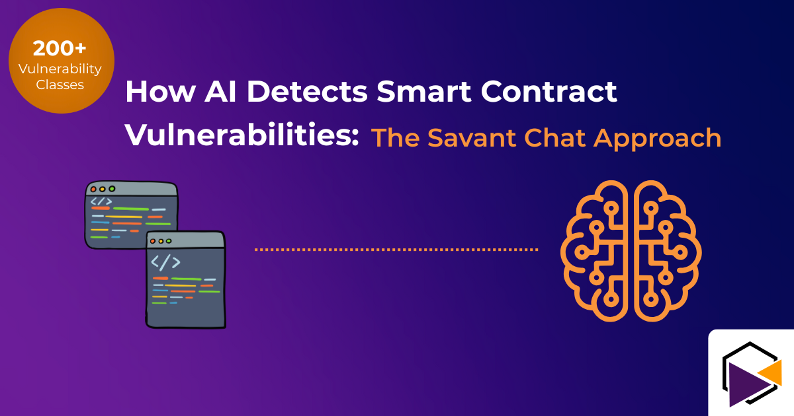

## Quick Summary (TL;DR)

AI-powered smart contract auditing uses multi-agent systems and large language models to detect vulnerabilities faster and more comprehensively than traditional methods. Savant Chat's sophisticated multi-agent architecture coordinates thousands of parallel AI calls across specialized models, analyzing code semantically rather than just syntactically. Our platform detects across 200+ vulnerability classes—the most comprehensive coverage in the industry—with proven detection rates on independent benchmarks and significantly lower false positive rates than traditional tools.

**Key takeaways:**

- AI auditing detects vulnerabilities through semantic code analysis, not just pattern matching
- Multi-agent AI systems can run thousands of specialized checks simultaneously
- Savant Chat supports Solidity, Vyper, and Rust across Ethereum, Near, and Solana
- 200+ vulnerability class coverage vs. 15-20 for free static analysis tools
- Combined AI + human auditing provides the strongest security posture

## Introduction

In 2024 alone, smart contract vulnerabilities led to $3.1 billion in losses across the Web3 ecosystem. Yet traditional auditing methods—whether manual code review or free static analysis tools—continue to miss critical bugs that hackers exploit within hours of deployment.

The challenge isn't a lack of skilled auditors or available tools. It's that smart contracts operate in an adversarial environment where a single logic error can drain an entire protocol. Free tools provide only basic pattern matching. Manual audits can't scale to match the speed and creativity of modern attackers.

This is where AI-powered auditing fundamentally changes the game.

**In this article, you'll learn:**

- How AI detects vulnerabilities differently than traditional tools
- The multi-agent architecture behind Savant Chat
- Why 200+ vulnerability class coverage matters
- Real-world performance benchmarks and comparisons
- When to use AI auditing vs. manual audits vs. both

## The Limitations of Traditional Smart Contract Auditing

Before understanding how AI improves security, it's important to recognize where traditional methods fall short.

### Manual Code Review

**Strengths:**

- Deep contextual understanding
- Can evaluate complex business logic
- Catches sophisticated attack vectors

**Limitations:**

- Time-intensive (2-4 weeks typical)
- Expensive ($20,000-$100,000+ per audit)
- Human fatigue leads to missed issues
- Doesn't scale with code complexity
- Auditor expertise varies widely

### Free Static Analysis Tools (Slither, Mythril, etc.)

**Strengths:**

- Fast execution
- Free or very low cost
- Catches some common vulnerability patterns

**Critical Limitations:**

- Designed as basic screening tools, not comprehensive security solutions
- Pattern-matching only—cannot understand semantic meaning or context
- Extremely high false positive rates (developers learn to ignore warnings)
- Misses novel and complex vulnerability types
- No understanding of business logic or protocol economics
- Covers only 15-20 common vulnerability patterns
- Requires extensive manual review and configuration

**The reality:** Free tools are free for a reason. They provide a baseline check but are wholly insufficient for production security. Relying solely on free static analysis is like using a metal detector to secure Fort Knox—it might catch something obvious, but sophisticated threats sail right through.

**Key insight:** The average smart contract has 3-5 vulnerabilities before deployment. Free tools catch some of them. Manual audits catch more. But neither approach is sufficient alone when millions of dollars are at stake.

## How AI-Powered Auditing Works Differently

AI-powered smart contract auditing represents a paradigm shift from syntactic pattern matching to semantic code understanding.

### Semantic Analysis vs. Pattern Matching

Traditional static analysis tools look for known bad patterns:

```solidity
// Pattern matcher flags this as "dangerous external call"
externalContract.call(data);
```

AI models understand the *meaning* and *context*:

- What is this external contract?
- Is the call protected by access controls?
- What happens if the call fails?
- Are there reentrancy risks given the state changes?
- What are the economic incentives for an attacker?

This semantic understanding allows AI to:

1. Identify novel vulnerability types not in existing databases
2. Understand complex interactions between contracts
3. Reason about edge cases and boundary conditions
4. Evaluate business logic for exploitation vectors

### The Multi-Agent Architecture

Savant Chat doesn't use a single AI model. It employs a sophisticated multi-agent system where specialized AI agents work in parallel, each focusing on specific vulnerability classes.

**How it works:**

1. **Code Decomposition:** The system breaks down your smart contract into logical components—state variables, functions, modifiers, external calls, etc.

2. **Parallel Agent Deployment:** Thousands of specialized AI agents analyze the code simultaneously:
   - **Reentrancy Detection Agent:** Analyzes state changes before/after external calls
   - **Access Control Agent:** Verifies permission systems and privilege escalation risks
   - **Arithmetic Agent:** Checks for overflow/underflow, precision loss, division by zero
   - **Logic Agent:** Evaluates business logic for edge cases and invariant violations
   - **Gas Optimization Agent:** Identifies expensive operations and DoS vectors
   - **Token Agent:** Analyzes ERC-20/721/1155 compliance and standard violations
   - **And 194+ more specialized agents**

3. **Cross-Agent Synthesis:** Results from all agents are synthesized to identify:
   - Complex multi-step attack paths
   - Interactions between different vulnerability types
   - Protocol-level risks that emerge from contract interactions

4. **Confidence Scoring:** Each finding includes a confidence score and severity rating, dramatically reducing false positives.

This approach allows Savant Chat to run what would be thousands of hours of manual analysis in minutes.

## Comprehensive Vulnerability Coverage: 200+ Classes

One of Savant Chat's key differentiators is breadth of coverage. While traditional static analysis tools detect 15-20 common patterns, our multi-agent system classifies and detects across **200+ vulnerability classes**—the most comprehensive taxonomy in the industry.

This exhaustive classification system covers:

### Common Vulnerabilities (that free tools sometimes catch):

- Reentrancy attacks
- Integer overflow/underflow
- Unchecked external calls
- Delegatecall to untrusted contracts
- tx.origin authentication
- Unprotected self-destruct

### Complex Vulnerabilities (that free tools miss):

- Cross-function reentrancy
- Cross-contract reentrancy
- Read-only reentrancy
- Flash loan attack vectors
- Price oracle manipulation
- Governance attack surfaces
- Economic exploit vectors
- Time-based vulnerabilities
- Precision loss in complex calculations
- State inconsistency across contract interactions
- Access control in proxy patterns
- Storage collision in upgradeable contracts
- Signature malleability
- Front-running and sandwich attacks
- Block timestamp manipulation

### Novel and Emerging Threats:

- New DeFi-specific attack patterns
- Layer 2 bridge vulnerabilities
- Cross-chain message passing exploits
- MEV extraction opportunities
- Advanced front-running scenarios
- Composability risks in protocol interactions
- Economic attacks on incentive mechanisms
- Privacy leaks in zero-knowledge systems

**And 180+ more specific vulnerability patterns.**

This comprehensive coverage means Savant Chat finds vulnerabilities that other tools—free or paid—simply don't look for. When we analyze a smart contract, we're not just checking a checklist of 20 items. We're evaluating against the entire known universe of smart contract vulnerabilities.

## Vulnerability Types AI Excels at Detecting

AI-powered auditing demonstrates particular strength in several vulnerability categories:

### 1. Reentrancy Attacks

**The Vulnerability:**
When external calls allow malicious contracts to re-enter your contract before state updates complete.

**Why AI Catches This Better:**

- Tracks complex state change sequences across multiple functions
- Identifies non-obvious reentrancy vectors (cross-function, cross-contract, read-only)
- Understands the economic incentive to exploit the race condition
- Tests thousands of potential reentrancy paths automatically

**Example Finding:**

```
CRITICAL: Potential reentrancy in withdrawFunds()
- External call to user.transfer() occurs before balance update
- Attacker can re-enter via fallback function
- Cross-contract reentrancy possible through protocol integration
- Estimated impact: Complete protocol drainage
- Confidence: High
```

### 2. Integer Overflow/Underflow and Precision Loss

**The Vulnerability:**
Arithmetic operations that exceed type bounds or lose precision in complex calculations.

**Why AI Catches This Better:**

- Analyzes all mathematical operations in context
- Identifies subtle overflow risks in complex calculations
- Understands when SafeMath isn't applied consistently
- Detects precision loss in division operations and fixed-point math

### 3. Access Control Bugs

**The Vulnerability:**
Missing or improperly implemented permission checks allowing unauthorized actions.

**Why AI Catches This Better:**

- Maps complete privilege hierarchy across all functions
- Identifies privilege escalation paths through proxy patterns
- Catches inconsistent permission patterns
- Flags missing zero-address checks on admin functions
- Understands role-based access control (RBAC) implementations

### 4. Logic Errors and Edge Cases

**The Vulnerability:**
Code that works as written but doesn't handle boundary conditions correctly.

**Why AI Catches This Better:**

- Generates and tests thousands of edge case scenarios
- Identifies unexpected state combinations
- Evaluates economic incentives for edge case exploitation
- Understands the *intent* vs. *implementation* gap

**Real Example:**
A DeFi protocol allowed users to withdraw with `amount = 0`, which didn't reduce balances but emitted events. An attacker could spam events to manipulate off-chain indexers. Manual auditors missed it. AI caught it because it tested boundary values systematically across all 200+ vulnerability classes.

### 5. Front-Running and MEV Vulnerabilities

**The Vulnerability:**
Transaction ordering allowing attackers to profit from knowledge of pending transactions.

**Why AI Catches This Better:**

- Models transaction ordering scenarios
- Identifies MEV extraction opportunities
- Evaluates economic profitability of front-running attacks
- Understands protocol-level MEV risks

### 6. Oracle Manipulation

**The Vulnerability:**
Price feeds and external data sources that can be manipulated for profit.

**Why AI Catches This Better:**

- Maps all oracle dependencies
- Identifies manipulation attack vectors
- Evaluates economic feasibility of oracle attacks
- Suggests mitigation strategies (TWAP, multiple sources, etc.)

## Real-World Performance: The Numbers

Benchmarks matter. Here's how AI-powered auditing performs in practice:

### CTFBench Validation

CTFBench is an independent benchmarking platform for smart contract security tools. It uses real-world Capture The Flag (CTF) challenges to evaluate detection capabilities.

**Savant Chat Performance:**

- **Proven detection rates on independent benchmarks**
- **Outperforms** other AI auditors and advanced LLMs on comprehensive testing
- **200+ vulnerability class coverage** vs. 15-20 for free tools
- **Significantly lower false positive rate** than traditional static analysis
- **Validated** on real-world exploits and edge cases

**What this means:**

- Comprehensive vulnerability detection across the entire threat landscape
- Extremely low false positive rate—developers don't ignore warnings
- Catches both common patterns AND novel exploits
- Performance that continues to improve with ongoing development

### Speed & Cost Comparison

| Audit Type | Typical Duration | Vulnerability Coverage | Cost Range |
|------------|------------------|------------------------|------------|
| Free Static Analysis (Slither, etc.) | Minutes | 15-20 patterns | Free (insufficient alone) |
| Manual Audit | 2-4 weeks | Depends on auditor | $20,000-$100,000+ |
| AI-Powered Audit (Savant Chat) | Minutes | 200+ classes | ~80% less than manual |

### Coverage Comparison

**Free Static Analysis Tools:**

- ~15-20 common vulnerability patterns
- High false positive rates
- No semantic understanding
- Misses complex and novel attacks
- Useful only as initial screening

**Savant Chat AI-Powered Analysis:**

- 200+ vulnerability classes
- Low false positive rates (high signal-to-noise)
- Semantic code understanding
- Detects both known patterns and novel exploits
- Comprehensive production-ready security

**Manual Expert Audit:**

- Coverage depends on auditor expertise and time constraints
- Deep contextual understanding
- Can evaluate complex business logic
- Limited by human bandwidth and attention span

**Key insight:** Free tools provide a basic first pass, but are wholly insufficient for production security. AI-powered auditing finds what free tools miss, at a fraction of manual audit costs. The strongest security comes from combining AI + human expertise.

## Multi-Language Support: Solidity, Vyper, and Rust

Smart contracts aren't written in just one language. Savant Chat provides native support for the three major smart contract languages:

### Solidity (Ethereum, BSC, Polygon, L2s)

- EVM bytecode analysis
- Full coverage of Solidity-specific vulnerabilities
- Support for all versions (including 0.8.x SafeMath changes)
- Understanding of common frameworks (OpenZeppelin, etc.)

### Vyper (Curve, DeFi protocols)

- Pythonic smart contract analysis
- Vyper-specific security patterns
- Understanding of Vyper's safety-first design choices
- Detection of patterns that violate Vyper principles

### Rust (Solana, Near)

- Rust ownership and borrowing analysis
- Solana program account validation
- Near contract state management
- Cross-program invocation security
- Understanding of Anchor and Near SDK patterns

**Why this matters:** Security tools that only understand Solidity leave Solana and Near developers without proper protection. Savant Chat provides comprehensive 200+ class coverage regardless of which blockchain you're building on.

## When to Use AI Auditing

AI-powered auditing fits into your development workflow in several ways:

### During Development (Continuous Security)

**Use case:** Integrate Savant Chat into your CI/CD pipeline  
**Benefit:** Catch bugs before they reach production  
**Frequency:** Every commit or pull request  
**Coverage:** All 200+ vulnerability classes on every code change

### Pre-Audit Preparation

**Use case:** Run AI audit before engaging manual auditors  
**Benefit:** Fix obvious issues first, let human auditors focus on complex logic  
**Result:** Faster, cheaper manual audits with better outcomes

### Post-Deployment Monitoring

**Use case:** Continuous monitoring of deployed contracts  
**Benefit:** Detect issues in production before they're exploited  
**Frequency:** Continuous or scheduled  
**Coverage:** Ongoing validation against emerging threat patterns

### Due Diligence (Investors/Acquirers)

**Use case:** Rapid security assessment of protocols  
**Benefit:** Technical due diligence in minutes vs. weeks  
**Frequency:** One-time per evaluation  
**Value:** Comprehensive risk assessment across 200+ vulnerability classes

## AI + Human: The Hybrid Approach

The most secure protocols combine AI and human expertise:

### AI strengths:

- Exhaustive coverage across 200+ vulnerability classes
- Testing thousands of edge cases humans wouldn't think of
- Consistent, unbiased analysis
- Fast iteration during development
- Catches patterns and novel exploits systematically

### Human strengths:

- Understanding complex business logic and intended behavior
- Evaluating sophisticated attack vectors requiring creativity
- Assessing economic incentives and game theory
- Making judgment calls on acceptable risk
- Contextual understanding of protocol goals

### Recommended workflow:

1. Run AI audit during development (continuous, 200+ class coverage)
2. Fix all high/critical AI findings
3. Engage manual auditors for final review
4. Run AI audit again after manual audit fixes
5. Deploy with continuous AI monitoring

This hybrid approach provides the strongest security posture at a fraction of traditional audit-only costs. You get the breadth of AI (200+ classes) combined with the depth of human expertise.

## Common Questions

### Q: Can AI completely replace human auditors?

**A:** No. AI excels at finding known patterns and testing edge cases across 200+ vulnerability classes, but human auditors provide contextual understanding and catch sophisticated, novel attacks that require creative thinking. The best approach combines both.

### Q: How does AI-powered auditing compare to manual audits and free tools?

**A:** Savant Chat outperforms both free static analysis tools and other AI auditors on independent CTFBench benchmarks. We detect across 200+ vulnerability classes vs. 15-20 for free tools like Slither. Manual audits vary by auditor expertise but typically catch 60-80% of vulnerabilities depending on time and budget constraints. No single approach is 100% effective, which is why we recommend the hybrid approach: AI for comprehensive automated detection + human auditors for complex business logic review.

### Q: Why not just use free tools like Slither or Mythril?

**A:** Free static analysis tools are useful as a first-pass screening but are designed as basic checks, not comprehensive security solutions. They cover only 15-20 common patterns, generate high false positive rates (leading developers to ignore warnings), and completely miss semantic bugs, complex attack vectors, and novel exploits. Relying solely on free tools for production security is extremely risky. Think of them as a smoke detector—useful, but not a complete fire prevention system.

### Q: Does AI auditing work for custom or unique smart contracts?

**A:** Yes. Unlike pattern-matching tools, AI understands code semantically. It can evaluate custom logic, novel protocols, and unique implementations because it reasons about what the code does, not just what it looks like. Our 200+ vulnerability class taxonomy covers both common patterns and novel threat vectors.

### Q: What makes Savant Chat different from other AI auditors?

**A:** Three key differentiators: (1) 200+ vulnerability class coverage—the most comprehensive in the industry, (2) multi-agent architecture where specialized AI models work in parallel rather than a single general model, and (3) extremely low false positive rates achieved through confidence scoring and cross-agent validation. This means we find more vulnerabilities with fewer false alarms.

### Q: How does Savant Chat handle false positives?

**A:** Our multi-agent system includes confidence scoring. Each finding includes a severity rating and confidence level. Low-confidence findings can be filtered out, giving developers a clean signal-to-noise ratio. This is a massive improvement over free tools that generate warnings developers learn to ignore.

### Q: What languages and blockchains are supported?

**A:** Savant Chat supports Solidity (Ethereum and EVM chains), Vyper (Curve and DeFi), and Rust (Solana and Near). Coverage includes all major smart contract platforms with the same 200+ vulnerability class taxonomy across all languages.

### Q: How long does an AI audit take?

**A:** Most audits complete in minutes. Exact time depends on code complexity and size, but you'll have comprehensive results across 200+ vulnerability classes.

### Q: Is my code sent to third parties or stored?

**A:** Savant Chat uses enterprise-grade privacy with data transformation. Code is processed securely and not stored or shared. We work with trusted AI providers under strict data handling agreements.

### Q: How much does AI auditing cost?

**A:** Significantly less than manual audits—typically 80% cost reduction. Savant Chat uses usage-based pricing. New users receive $75 in free credits to get started.

## Getting Started with Savant Chat

Ready to secure your smart contracts with AI-powered auditing?

### Step 1: Sign Up

Create your free account at [savant.chat](https://savant.chat) and receive $75 in free credits—no credit card required.

### Step 2: Upload Your Contract

Paste your Solidity, Vyper, or Rust code directly into the platform, or integrate with your GitHub repository.

### Step 3: Run Your First Audit

Click "Audit" and receive comprehensive vulnerability analysis across 200+ classes in minutes.

### Step 4: Review Findings

Each finding includes:

- Severity rating (Critical, High, Medium, Low, Informational)
- Detailed explanation of the vulnerability
- Affected code location
- Recommended remediation
- Confidence score
- Vulnerability class classification

### Step 5: Fix and Re-Audit

Make fixes and run the audit again to verify vulnerabilities are resolved.

### Step 6: Integrate into CI/CD (Optional)

For continuous security, integrate Savant Chat into your development pipeline. Every commit gets automatically audited across all 200+ vulnerability classes.

## Conclusion

AI-powered smart contract auditing represents a fundamental shift in how we approach blockchain security. By using multi-agent systems to analyze code semantically rather than syntactically, and by covering 200+ vulnerability classes rather than just 15-20 common patterns, tools like Savant Chat can detect vulnerabilities that traditional methods miss—and do it in minutes rather than weeks.

**Key takeaways:**

- AI achieves proven detection rates on independent benchmarks with extremely low false positive rates
- 200+ vulnerability class coverage vs. 15-20 for free static analysis tools—the most comprehensive in the industry
- Multi-agent architecture enables comprehensive analysis across the entire threat landscape
- AI excels at finding edge cases, logic errors, novel exploits, and subtle vulnerabilities
- The hybrid approach (AI + human auditors) provides the strongest security
- AI auditing costs 80% less than manual audits while providing faster, more comprehensive results

Smart contract security isn't optional—it's existential. Every bug is a potential exploit. Every exploit is a headline. Every headline is a setback for Web3 adoption.

Free tools provide basic screening but miss the majority of real threats. Manual audits are thorough but slow and expensive. AI-powered auditing bridges the gap—comprehensive coverage at a fraction of the cost and time.

The question isn't whether to use AI auditing. It's whether you can afford not to.

**Next steps:**

1. Start your free audit at [savant.chat](https://savant.chat) ($75 in credits, no card required)
2. Review your first comprehensive vulnerability report across 200+ classes
3. Integrate AI auditing into your development workflow
4. Sleep better knowing your contracts are continuously monitored

## About Savant Chat

Savant Chat is an AI-powered smart contract security platform that provides automated vulnerability detection, real-time monitoring, and comprehensive security analysis for blockchain projects. Using a sophisticated multi-agent AI system, Savant Chat provides industry-leading detection rates across 200+ vulnerability classes—the most comprehensive coverage available—while maintaining extremely low false positive rates.

**Key features:**

- 200+ vulnerability class coverage—the industry's most comprehensive taxonomy
- Support for Solidity, Vyper, and Rust across Ethereum, Solana, and Near
- CI/CD integration for continuous security monitoring
- Multi-agent AI architecture with specialized detection agents
- Proven detection rates on independent benchmarks
- Results in minutes, not weeks
- Trusted by 1inch, Lido, Pessimistic, Oxorio, and other leading Web3 projects

**Get started today with $75 in free credits →** [savant.chat](https://savant.chat)

---

*Last updated: February 12, 2026*  
*Article type: Educational, Technical*
