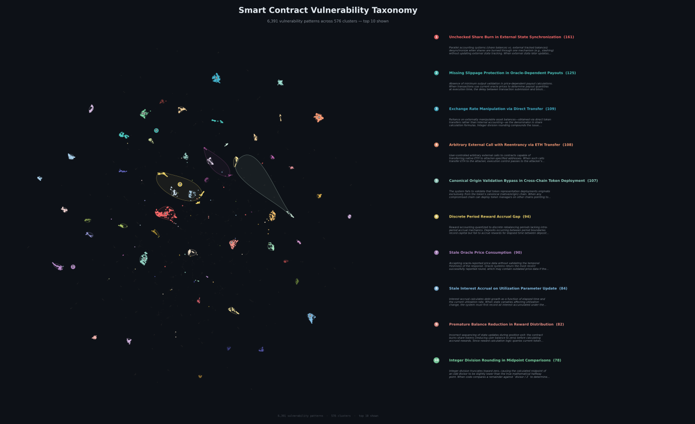

Modern LLMs reason about code well. But they aren't specialized in smart contract auditing, and they have a knowledge cutoff. They know nothing about hacks from the last year. The Web3 attack surface shifts every month as new protocol types bring new failure modes.

When a senior auditor opens a lending protocol and sees rounding in share calculations, they already know where this broke before and what the attack looked like. They read code while flipping through a mental reference book built over years of practice.

We built that reference book for our AI agent. This post is about how.

<!-- truncate -->

## 20,000 vulnerabilities, descriptions + code

We collected around 20,000 publicly available smart contract vulnerabilities. Every entry includes the code, the actual contract where the vulnerability lives, paired with the attack description. A vulnerability without code is a joke without a punchline: you get that something happened, but you can't reproduce the reasoning.

About half the entries had broken code links. Dead GitHub URLs, deleted repos, moved commits. We recovered that half by searching repositories by commit hashes, running snippet-based lookups across GitHub, and matching reports back to specific contract versions. Part of this work was done by AI agents. We had to build a separate data recovery pipeline before we could start processing anything.

## From 20,000 entries to 200 classes

Out of 20,000, we selected roughly 6,500 entries where the description and code were complete enough to extract a reproducible pattern.

Clustering came next. We started by building ground truth: we sampled random pairs of vulnerabilities and had a neural network judge whether each pair belongs to the same class. This gave us a reference set for tuning the clustering hyperparameters. We tuned with deliberate asymmetry: the algorithm should over-split rather than over-merge. Merging two nearby clusters later is easy. Untangling one that got glued together is an order of magnitude harder.

We used UMAP both as an intermediate dimensionality reduction step and for the final visualization.

The first pass produced several hundred clusters, singletons included. Then reranking: a neural network reviewed cluster boundaries, looked at points near the edges, and reassigned the ones that belonged closer to a neighbor. Iterative refinement brought us to about 200 stable classes and some singletons.

Here's what it looks like:

*Each dot is a real vulnerability with code and a description. The 10 largest clusters are labeled.*

Dense regions are well-studied attack classes: oracle manipulation, rounding issues, reentrancy in various forms. Sparse areas are the rare ones, and usually the hardest to catch.

## A reference book, not a pile of reports

Raw historical audit reports are noisy context. Project-specific details, duplicates, wildly inconsistent quality. Feed a model 50 similar reports and it drowns in specifics and loses the point.

We distilled each cluster into a structured entry formatted like a textbook chapter on auditing. A typical entry has a simplified model of a vulnerable contract, the attack mechanism, what types of contracts are susceptible, and an example fix. A vector textbook for in-context learning. The model gets attack patterns rather than individual bugs: how they work, where they happen.

## Why the reference book comes last

We don't hand the reference book to the agent at the start of an audit. It begins with a blank slate, reads the code, goes through the documentation, and looks for original attack paths on its own. If you feed it hints upfront, it anchors on known patterns and may miss something new.

The reference book comes in at the final stage, after the model has already given everything it can for this specific codebase. Like an auditor who thinks first, then opens the reference: did I miss something known?

The RAG is multi-stage, with lookups by code characteristics, project type, individual contracts, and individual functions. From each relevant cluster, it pulls the single closest case. Clusters are a deduplication mechanism: when auditing a lending protocol, the agent might get a rounding case from one cluster, a reentrancy case from another, a DAO governance case from a third. Different angles on the same codebase, instead of ten variations of the same thing.

<svg width="100%" viewBox="0 0 680 700" xmlns="http://www.w3.org/2000/svg">
<defs><marker id="arrow" viewBox="0 0 10 10" refX="8" refY="5" markerWidth="6" markerHeight="6" orient="auto-start-reverse"><path d="M2 1L8 5L2 9" fill="none" stroke="context-stroke" strokeWidth="1.5" strokeLinecap="round" strokeLinejoin="round"/></marker></defs>

<rect x="130" y="40" width="170" height="44" rx="8" fill="#2c2c2a" stroke="#5f5e5a" strokeWidth="0.5"/>
<text className="ttl" x="215" y="62" textAnchor="middle" dominantBaseline="central">Source code</text>

<rect x="380" y="40" width="170" height="44" rx="8" fill="#2c2c2a" stroke="#5f5e5a" strokeWidth="0.5"/>
<text className="ttl" x="465" y="62" textAnchor="middle" dominantBaseline="central">Documentation</text>

<path d="M215 84 V108 H340" fill="none" className="edge"/>
<path d="M465 84 V108 H340" fill="none" className="edge"/>
<line x1="340" y1="108" x2="340" y2="135" className="edge" markerEnd="url(#arrow)"/>

<rect x="190" y="135" width="300" height="56" rx="8" fill="#04342C" stroke="#0F6E56" strokeWidth="0.5"/>
<text className="ttl" x="340" y="153" textAnchor="middle" dominantBaseline="central" fill="#9FE1CB">Sample extraction</text>
<text className="sub" x="340" y="173" textAnchor="middle" dominantBaseline="central" fill="#5DCAA5">code + documentation pairs</text>

<line x1="340" y1="191" x2="340" y2="230" className="edge" markerEnd="url(#arrow)"/>

<rect x="60" y="230" width="430" height="185" rx="12" fill="none" className="dash"/>
<text className="lbl" x="275" y="250" textAnchor="middle">Auditor subagent</text>

<rect x="80" y="270" width="175" height="56" rx="8" fill="#04342C" stroke="#0F6E56" strokeWidth="0.5"/>
<text className="ttl" x="168" y="288" textAnchor="middle" dominantBaseline="central" fill="#9FE1CB">Passes 1..N-1</text>
<text className="sub" x="168" y="308" textAnchor="middle" dominantBaseline="central" fill="#5DCAA5">clean context</text>

<path d="M220 326 C220 348, 115 348, 115 326" fill="none" className="edge" markerEnd="url(#arrow)"/>
<text className="lbl" x="168" y="366" textAnchor="middle">each pass output feeds the next</text>

<line x1="255" y1="298" x2="290" y2="298" className="edge" markerEnd="url(#arrow)"/>

<rect x="290" y="270" width="185" height="56" rx="8" fill="#26215C" stroke="#534AB7" strokeWidth="0.5"/>
<text className="ttl" x="382" y="288" textAnchor="middle" dominantBaseline="central" fill="#CECBF6">Final pass</text>
<text className="sub" x="382" y="308" textAnchor="middle" dominantBaseline="central" fill="#AFA9EC">with reference book</text>

<rect x="510" y="270" width="155" height="56" rx="8" fill="#412402" stroke="#854F0B" strokeWidth="0.5"/>
<text className="ttl" x="588" y="288" textAnchor="middle" dominantBaseline="central" fill="#FAC775">Vulnerability DB</text>
<text className="sub" x="588" y="308" textAnchor="middle" dominantBaseline="central" fill="#EF9F27">~200 classes</text>

<line x1="510" y1="298" x2="475" y2="298" className="edge" markerEnd="url(#arrow)"/>

<line x1="340" y1="415" x2="340" y2="450" className="edge" markerEnd="url(#arrow)"/>

<rect x="190" y="450" width="300" height="56" rx="8" fill="#4A1B0C" stroke="#993C1D" strokeWidth="0.5"/>
<text className="ttl" x="340" y="468" textAnchor="middle" dominantBaseline="central" fill="#F5C4B3">Critic subagent</text>
<text className="sub" x="340" y="488" textAnchor="middle" dominantBaseline="central" fill="#F0997B">PoC validation</text>

<line x1="340" y1="506" x2="340" y2="540" className="edge" markerEnd="url(#arrow)"/>

<rect x="220" y="540" width="240" height="44" rx="8" fill="#2c2c2a" stroke="#5f5e5a" strokeWidth="0.5"/>
<text className="ttl" x="340" y="562" textAnchor="middle" dominantBaseline="central" fill="#e8e6df">Deduplication</text>

<line x1="340" y1="584" x2="340" y2="618" className="edge" markerEnd="url(#arrow)"/>

<rect x="220" y="618" width="240" height="44" rx="8" fill="#2c2c2a" stroke="#5f5e5a" strokeWidth="0.5"/>
<text className="ttl" x="340" y="640" textAnchor="middle" dominantBaseline="central" fill="#e8e6df">Report</text>

</svg>

## Early results

Preliminary data. We took several cases from an independent benchmark and saw detection rates go up 20-50%. Before testing, we removed every vulnerability from our dataset that overlapped with the benchmark. No data leakage.

Full benchmark run is in progress. We'll publish detailed numbers separately.

In parallel, we're building a critic agent that constructs proof of concept exploits for detected vulnerabilities and checks that the attack is actually reproducible. More on that later.

## What's next

Our target for spring 2026 is an autonomous auditor that performs at the level of a senior from a top-tier auditing firm. The reference book is one component. Here's the rest.

**Agentic components.** The agent used to look at code and make claims about it. Then look again and critique those claims. Now we're giving it the ability to run code, test a hypothesis, get feedback from execution. From "read and think" to "read, try, verify."

**Formal verification.** The agent will be able to check complex hypotheses with formal methods instead of spending inference on things that can be proven mathematically.

**Model orchestration.** Auditing needs creativity to imagine an attack path nobody considered, rigor to formally verify it works, domain knowledge to recall a similar hack, and discipline to walk through every line and miss nothing. These don't coexist naturally in a single model.

It's a D&D party problem. You need a Fighter, a Cleric, a Mage, and a Rogue. Four Mages wipe on the third dungeon level. No foundation model provider ships that kind of spread today. We take the best state-of-the-art models and give each one its role: one generates attack hypotheses, another verifies, a third works with historical context. The best auditing system is an orchestra, not a soloist.

---

The agent with the built-in vulnerability reference book is already in production at SavantChat. Upload your project and see for yourself.

Benchmark results coming soon. This reference book is one of several things we're shipping this spring. The rest aren't far behind.
