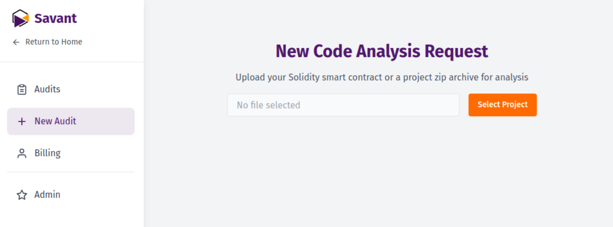

:::info
This guide is for **Foundry / Solidity projects**. For ZK circuits, Rust or Go
codebases, backends, and other languages, see
[Prepare any codebase for audit](/docs/prepare-any-codebase).
:::

The fastest way to load a GitHub project into [Savant Chat](https://savant.chat) is to download the repository as a ZIP archive and upload it.



In most cases, that's all it takes.

Some repositories need more: non-standard dependency managers, outdated compiler versions, closed-source libraries — or git submodules, which GitHub's ZIP export leaves empty and which Foundry needs in order to build.

For those projects, a few extra steps. First, clone the project locally and install all its dependencies — both Node.js and Foundry packages, if the project uses them.

Then save the following script as `savant-build.sh` in the root folder of your project:

```bash
#!/bin/bash

if command -v realpath >/dev/null 2>&1; then
    DIR_NAME=$(basename "$(dirname "$(realpath "$0")")")
else
    DIR_NAME=$(basename "$(cd "$(dirname "$0")" && pwd)")
fi
TARGET_DIR="$DIR_NAME-savant"

if [ -d "$TARGET_DIR" ]; then
    echo "The $TARGET_DIR directory already exists."
    read -p "Do you want to delete $TARGET_DIR and $TARGET_DIR.zip and create an empty directory? (y/n): " answer
    if [ "$answer" = "y" ] || [ "$answer" = "Y" ]; then
        rm -rf "$TARGET_DIR"
        [ -f "$TARGET_DIR.zip" ] && rm "$TARGET_DIR.zip"
        mkdir "$TARGET_DIR"
    else
        echo "Operation cancelled."
        exit 0
    fi
else
    mkdir "$TARGET_DIR"
fi

find . -name "*.sol" -not -path "./$TARGET_DIR/*" | while read file; do
    target_dir="$TARGET_DIR/$(dirname "$file")"
    mkdir -p "$target_dir"
    cp "$file" "$target_dir/"
done

find . \( -name "*.md" -o -name "*.txt" \) -not -path "./$TARGET_DIR/*" -not -path "./node_modules/*" -not -path "./lib/*" | while read file; do
    target_dir="$TARGET_DIR/$(dirname "$file")"
    mkdir -p "$target_dir"
    cp "$file" "$target_dir/"
done

if [ -f "./foundry.toml" ]; then
    touch "$TARGET_DIR/.foundry"
fi

if command -v zip &> /dev/null; then
    ARCHIVE="$TARGET_DIR.zip"
    zip -r "$ARCHIVE" "$TARGET_DIR"
elif command -v tar &> /dev/null; then
    ARCHIVE="$TARGET_DIR.tar.gz"
    tar -czf "$ARCHIVE" "$TARGET_DIR"
else
    echo "ERROR: Neither zip nor tar utilities were found for archiving."
    exit 1
fi

echo "Done! The $TARGET_DIR directory has been created and archived in $ARCHIVE"
```

To use the script:

1. Save it as `savant-build.sh`
2. Make it executable with: `chmod +x savant-build.sh`
3. Run it with: `./savant-build.sh`

You'll get a `your-project-name-savant.zip` archive in your project folder with all dependencies included.

:::warning

If your Foundry project keeps dependencies in a non-standard path (anything other than `lib/`), rename that directory to `lib` and update `remappings.txt` before running the script.

:::


